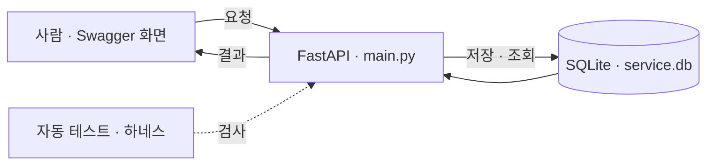

# Todo API 실습 결과

AI와 함께 할 일 관리 API를 구현하고 자동 검사와 GitHub PR로 확인하는 실습입니다.
원본 교재: [wanhee/ai-campus-starter-kit](https://github.com/wanhee/ai-campus-starter-kit).
원본 README는 [교재 안내 보관본](docs/TRAINING_TEMPLATE.md)에 남겼습니다.

폴더 이동 후 원격 저장소의 29개 파일을 다시 대조했습니다.
[재검토 결과와 추가 보완](docs/AUDIT.md)에는 완료·보완·선택 과제를 구분했습니다.
기본 기능 기준은 [MINIMUM_FEATURE_SPEC.md](MINIMUM_FEATURE_SPEC.md)에서 확인합니다.

## 무엇을 만들었나요

할 일 등록·조회·수정, 제목/설명 검색, 차단 태그 제외, 관리자 로그인·삭제를
제공하는 FastAPI 서버입니다. Swagger 화면에서 요청을 보내고 SQLite 파일에 데이터를 저장합니다.
생성·조회·수정은 실습용 공유 목록이며 삭제에 관리자 토큰이 필요합니다.



## Windows에서 실행

최초 설치:
```powershell
git clone https://github.com/osos8528-lang/test.git
cd test
python -m venv .venv
.\.venv\Scripts\python.exe -m pip install -r requirements-dev.txt
```

이미 설치했다면:
```powershell
.\.venv\Scripts\python.exe run_local.py
```

표시되는 입력란에서 **실습용 관리자 비밀번호**를 정합니다. 입력은 화면에 표시되지 않습니다.
서버 프로세스의 환경변수로 전달되며 코드에 저장되지 않습니다.
[API 실습 화면](http://127.0.0.1:8000/docs)을 열고, 종료할 때 터미널에서 Ctrl+C를 누릅니다.

- 127.0.0.1은 서버를 실행한 자기 컴퓨터입니다. 인터넷에 공개 배포한 주소가 아닙니다.
- 서버 창을 닫으면 연결할 수 없습니다. GitHub에 올리는 것만으로 서버가 실행되지는 않습니다.
- ADMIN_PASSWORD 환경변수를 별도 설정해도 됩니다. .env.example은 안내용이며 자동으로 읽히지 않습니다.
- DB_FILE 환경변수로 DB 경로를 변경할 수 있습니다. 기본값은 프로그램 옆의 service.db입니다.
- 비밀번호 없이 직접 서버를 시작하면 일반 Todo는 동작하지만 관리자 로그인은 503을 반환합니다.

## 화면에서 해볼 순서

1. **POST /todos → Try it out**에 아래 JSON을 넣고 Execute를 누릅니다.
2. **GET /todos**로 목록을 보고 **GET /todos/search**의 q에 실습을 넣습니다.
3. tags가 spam인 항목도 만든 뒤 **GET /todos/filtered**에서 제외되는지 봅니다.
4. **POST /admin/login**에 시작할 때 정한 비밀번호를 넣습니다.
5. 응답의 token 값만 **Authorize → HTTPBearer**에 붙여 넣습니다.
6. **DELETE /admin/todos/{todo_id}**에 삭제할 id를 넣습니다.

```json
{
  "title": "AI 실습 복습",
  "description": "브랜치와 API 이해하기",
  "is_completed": false,
  "tags": "study,python"
}
```

| 기능 | 요청 |
|---|---|
| 등록 / 전체 조회 | POST /todos, GET /todos |
| 개별 조회 / 수정 | GET /todos/{todo_id}, PUT /todos/{todo_id} |
| 제목 또는 설명 검색 | GET /todos/search?q=검색어 |
| 차단 태그 제외 | GET /todos/filtered |
| 관리자 로그인 / 삭제 | POST /admin/login, DELETE /admin/todos/{todo_id} |

PUT은 전체 교체입니다. 선택 필드를 생략하면 기본값이 적용됩니다.
차단 태그는 spam, ad, private, temp입니다. 대소문자와 공백을 정리한 뒤 정확한 태그를 비교합니다.
검색에서 %, _도 일반 문자로 취급합니다.

## 적용한 개선

- SQL에 입력값을 붙이지 않고 매개변수로 전달합니다.
- 사용자 비밀번호는 무작위 salt와 PBKDF2-HMAC-SHA256으로 저장합니다.
- 관리자 비밀번호는 환경변수로 받습니다. 토큰은 무작위 생성하고 1시간 후 만료합니다.
- DB에는 토큰의 해시만 저장합니다. 일반 사용자 토큰으로 관리자 삭제를 할 수 없습니다.
- SQLite WAL과 5초 대기 설정을 사용하고, 요청 종료 때 DB 연결을 닫습니다.
- 부하 도구의 실패 경로에서도 연결을 닫아 Windows 파일 삭제 오류를 수정했습니다.
- 하네스 출력의 API p99/운영 안전 보장 등 실제 검사 범위를 넘는 표현을 수정했습니다.
- PR에서 규칙 검사 코멘트와 실제 테스트·커버리지·하네스를 실행합니다.

기존 /api/auth/*, /api/items 경로도 유지합니다. 예전 MD5 사용자 비밀번호는 인증에
사용하지 않으며 기존 DB를 자동 삭제하거나 비밀번호를 자동 변환하지 않습니다.

## 검증 결과

2026-10-07, Windows, Python 3.14.5에서 측정했습니다.

| 검사 | 결과 |
|---|---|
| 자동 테스트 | 재검토 후 57개 통과 (기존 33개 + 새 검증 24개) |
| main.py 실행 줄 커버리지 | 100% (215개 실행 대상 줄) |
| 실습 하네스 | 지정된 3단계 검사 통과 |
| 실제 POST /todos | 동시 작업자 20개, 1,000건 중 1,000건 HTTP 201 |
| 실제 API 처리량 | 초당 161.4건 |
| 실제 API p50 / p95 / p99 | 70.52 / 272.08 / 1,107.84 ms |

**실제 API p99는 100ms 목표를 충족하지 못했습니다.**
하네스 Stage 3는 집합 생성·조회 시간과 WAL을 설정하는 execute 호출을 정적으로 확인합니다.
API p99, 전체 보안, 운영 가용성을 보장하지 않습니다.
커버리지 100%도 모든 상황에서 올바르게 동작한다는 뜻은 아닙니다.

별도 DB 시뮬레이션은 기존 설정에서 38/100건 실패, 개선 설정에서 0/100건 실패했습니다.
대기 시간과 인위적 지연 등 여러 조건이 다르므로 WAL만의 효과로 해석할 수 없습니다.
p99는 382.20ms에서 729.76ms로 늘었습니다. 실패가 줄어든 것과 빨라진 것은 별개입니다.

[상세 검증 기록](docs/VALIDATION.md) · [API 부하 원본 출력](docs/api_load.txt) ·
[DB 비교 원본 출력](docs/sqlite_comparison.txt)

추가 재검토에서 원본 중복 제거 함수와 현재 함수를 같은 5,000개 레코드로 7회
비교했습니다. 결과는 같고 중앙값은 403.8901ms / 0.2654ms였습니다.
작은 함수의 계산 시간이며 전체 API 속도가 이 비율로 개선됐다는 뜻은 아닙니다.
전체 처리량의 복잡도는 원본 최악 O(N²), 현재 평균 O(N)이고, set 한 번 조회가 평균 O(1)입니다.

하네스는 이제 Python 구문 구조(AST)를 검사하고, 테스트가 없거나 읽을 수 없는 소스가
있으면 실패합니다. 85% main.py 줄 커버리지도 직접 요구합니다.
PR 리뷰도 같은 검사를 사용하며 발견 사항이 있으면 작업을 실패로 표시합니다.
GitHub main의 필수 검사/브랜치 보호 규칙은 별도로 설정하지 않았습니다.

## 다시 검사하기

별도의 PowerShell에서:
```powershell
.\.venv\Scripts\python.exe -m pytest tests -q --tb=short --cov=main --cov-report=term-missing --cov-fail-under=85
.\.venv\Scripts\python.exe harness/check_harness.py
.\.venv\Scripts\python.exe harness/simulate_load.py
```

테스트와 기본 DB 비교는 별도 DB를 사용합니다.
부하 도구에 --url을 지정하면 그 서버에 실제 할 일이 생성됩니다.
기록된 1,000건 실험은 별도 서버·DB에서 수행했습니다.

## GitHub 작업 흐름

feature/todo-service에서 수정 → 테스트 → 커밋 → 푸시 → PR → GitHub Actions 확인 → main에 병합.

[실습 PR](https://github.com/osos8528-lang/test/pulls) ·
[자동 검사 실행 기록](https://github.com/osos8528-lang/test/actions)

교재의 AI 리뷰 봇은 이 저장소에서는 정해진 패턴을 찾는 스크립트이며 외부 AI 모델을 호출하지 않습니다.
이번 실습은 여러 독립 AI 에이전트를 운영하는 시스템까지 구현한 것은 아닙니다.

## 적용 범위

학습용 로컬 서비스입니다. 공개 운영에는 사용자별 권한, 로그인 시도 제한, HTTPS와
비밀값 관리, 백업·복구, 관측과 알림, 실제 환경의 성능 검증이 추가로 필요합니다.
현재 Todo는 사용자별로 분리되지 않습니다. 대규모 검색·필터 성능도 보장하지 않습니다.
보안 개선을 초기에 함께 적용했으므로 취약한 Todo 초안을 공개 PR로 올렸다가
자동 반려되는 단계는 재현하지 않았습니다. 원본 초기 코드는 Git 이력으로 비교할 수 있습니다.
